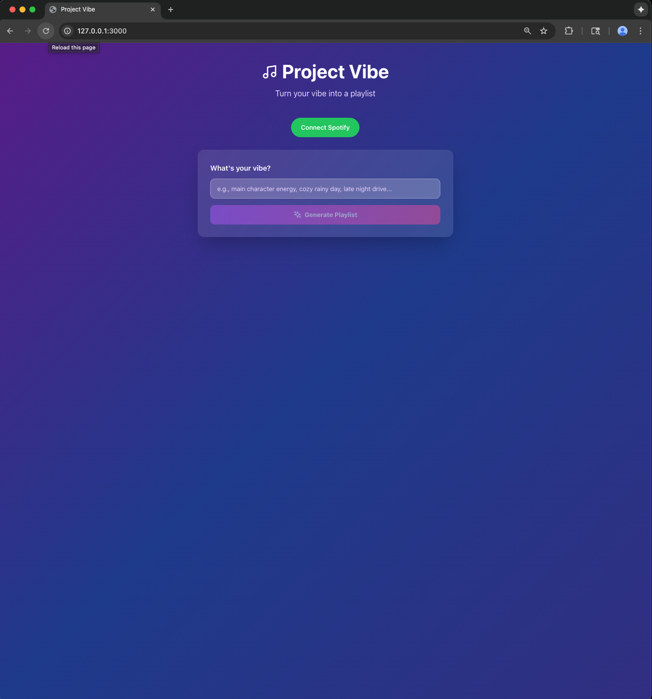
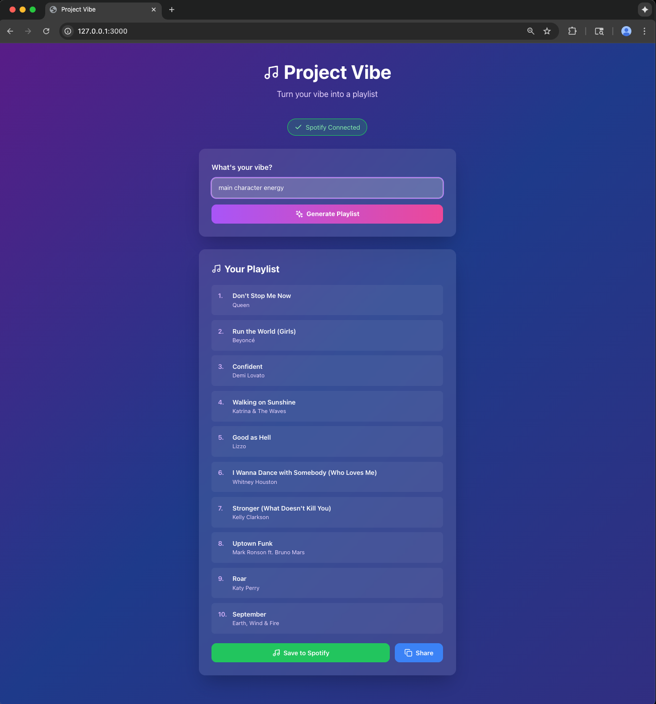
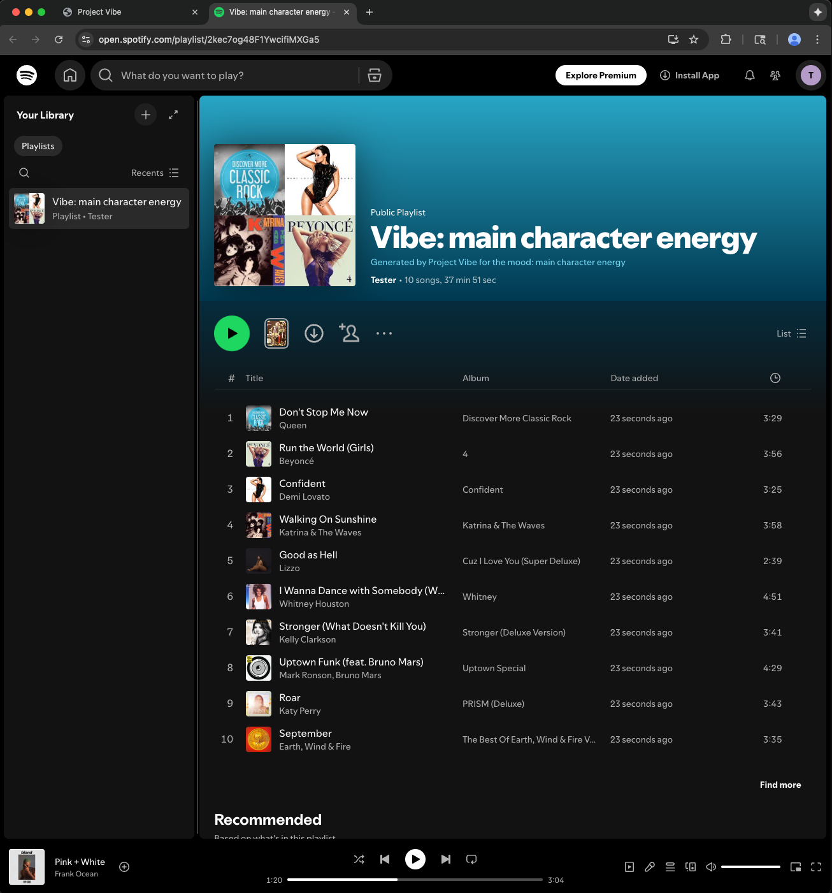

# Project Vibe

AI-powered Spotify playlist generator that creates personalized 10-song playlists based on your mood or vibe using Google Gemini AI.

## Features

- **AI-Powered Generation** - Describe your mood and let Gemini AI curate the perfect playlist
- **Spotify Integration** - Seamlessly save playlists directly to your Spotify account
- **OAuth 2.0 Authentication** - Secure authentication with Spotify
- **One-Click Creation** - Generate and save playlists with minimal friction
- **Docker Containerized** - Consistent development environment across all platforms

## Demo








## Tech Stack

### Frontend
- **React** 18.2.0 - UI framework
- **Tailwind CSS** - Styling via CDN
- **Lucide React** - Icon library

### Backend
- **FastAPI** - Python web framework
- **Google Gemini AI** - Playlist generation
- **Spotify Web API** - Music streaming integration
- **OAuth 2.0** - Secure authentication

### DevOps
- **Docker** & **Docker Compose** - Containerization
- **Python** 3.11.9 - Backend runtime
- **Node.js** 18.20.2 - Frontend runtime

## Architecture

```
┌─────────────┐         ┌─────────────┐         ┌──────────────┐
│   Browser   │ ◄─────► │   Frontend  │ ◄─────► │   Backend    │
│             │         │   (React)   │         │  (FastAPI)   │
└─────────────┘         └─────────────┘         └──────────────┘
                              │                        │
                              │                        ├─────► Spotify API
                              │                        │
                              │                        └─────► Google Gemini AI
```

For detailed architecture documentation, see [ARCHITECTURE.md](documentation/ARCHITECTURE.md).

## How It Works

1. **Connect Spotify** - User authorizes the app via OAuth 2.0
2. **Enter Your Vibe** - Type a mood like "cozy rainy day" or "main character energy"
3. **AI Generation** - Gemini analyzes your vibe and generates 10 matching songs
4. **Save to Spotify** - One click creates the playlist in your Spotify account
5. **Share** - Copy formatted playlist text to share on social media

## Security Features

- HTTP-only cookies for session management (prevents XSS attacks)
- CSRF protection via state parameter in OAuth flow
- Server-side token storage (never exposed to client)
- Environment variable configuration for sensitive credentials
- Explicit IPv4 redirect URIs per Spotify security requirements

## Getting Started

### Prerequisites

- Docker (version 20.10+)
- Docker Compose (version 2.0+)
- Git
- Spotify Developer account
- Google Gemini API key

### Quick Start

1. **Clone the repository**
   ```bash
   git clone https://github.com/ameyaphalke09-code/project-vibe.git
   cd project-vibe
   ```

2. **Set up Spotify Developer App**
   - Go to [Spotify Developer Dashboard](https://developer.spotify.com/dashboard)
   - Create a new app
   - Add redirect URI: `http://127.0.0.1:8000/api/v1/auth/callback`
   - Copy your Client ID and Client Secret

3. **Get Google Gemini API Key**
   - Go to [Google AI Studio](https://makersuite.google.com/app/apikey)
   - Create an API key

4. **Create environment configuration**
   
   Create a `.env` file in the root directory:
   ```bash
   GEMINI_API_KEY=your_gemini_api_key_here
   SPOTIFY_CLIENT_ID=your_spotify_client_id_here
   SPOTIFY_CLIENT_SECRET=your_spotify_client_secret_here
   FRONTEND_URL=http://127.0.0.1:3000
   BACKEND_URL=http://127.0.0.1:8000
   REACT_APP_API_BASE=http://127.0.0.1:8000
   ```

5. **Start the application**
   ```bash
   docker-compose up --build
   ```

6. **Access the app**
   
   Open your browser to: **http://127.0.0.1:3000**
   
   (Note: Use `127.0.0.1` not `localhost` due to Spotify OAuth requirements)

## Detailed Setup Instructions

For comprehensive setup instructions including troubleshooting, see the sections below.

### Verifying Installation

After starting with `docker-compose up --build`, you should see:

```
backend-1   | INFO:     Uvicorn running on http://0.0.0.0:8000
frontend-1  | Compiled successfully!
```

### Using the Application

1. **Connect Spotify**
   - Click "Connect Spotify" button
   - Authorize the app on Spotify
   - You'll be redirected back with "Spotify Connected" badge

2. **Generate a Playlist**
   - Enter your vibe (e.g., "cozy rainy day", "workout energy")
   - Click "Generate Playlist"
   - Wait for AI to generate 10 songs

3. **Save to Spotify**
   - Click "Save to Spotify"
   - Playlist is created in your Spotify account
   - Optionally open it directly in Spotify

4. **Share**
   - Click "Share" to copy formatted text
   - Paste on social media

### Stopping the Application

```bash
# Press Ctrl+C in the terminal, or:
docker-compose down
```

## API Documentation

Full API reference available at [API.md](documentation/API.md).

### Key Endpoints

- `GET /api/v1/auth/login` - Initiate Spotify OAuth
- `GET /api/v1/auth/callback` - OAuth callback handler
- `POST /api/v1/playlist/generate` - Generate playlist from vibe
- `POST /api/v1/playlist/create` - Create playlist in Spotify

## Project Structure

```
project-vibe/
├── backend/
│   ├── Dockerfile
│   ├── main.py
│   └── requirements.txt
├── frontend/
│   ├── public/
│   │   └── index.html
│   ├── src/
│   │   ├── App.js
│   │   ├── index.js
│   │   └── index.css
│   ├── Dockerfile
│   └── package.json
├── documentation/
│   ├── ARCHITECTURE.md
│   ├── API.md
│   ├── CONTRIBUTING.md
│   ├── adb_project_vibe_mvp_v2.2_as_built.md
│   └── prd_project_vibe_mvp_v2.2_as_built.md
├── docker-compose.yml
├── .env (create this)
├── .gitignore
└── README.md
```

## Troubleshooting

### Issue: "INVALID_CLIENT: Invalid redirect URI"

**Solution:**
- Verify Spotify redirect URI is exactly `http://127.0.0.1:8000/api/v1/auth/callback`
- Access app at `http://127.0.0.1:3000` (not localhost)

### Issue: "Failed to generate playlist"

**Solution:**
- Check `GEMINI_API_KEY` in `.env` file
- Verify Gemini API is enabled for your Google account

### Issue: "Not authenticated" when saving playlist

**Solution:**
- Click "Connect Spotify" again
- Clear browser cookies and retry
- Verify Spotify Client ID and Secret are correct

### View Logs

```bash
# All logs
docker-compose logs

# Backend only
docker-compose logs backend

# Frontend only
docker-compose logs frontend

# Follow logs in real-time
docker-compose logs -f
```

## Known Limitations

- **Session Persistence**: Sessions stored in-memory (lost on restart)
- **Token Expiry**: Access tokens expire after 1 hour (requires re-authentication)
- **User Limit**: Spotify Development Mode restricted to 25 users
- **Local Only**: Current setup for local development only

## Production Deployment

This setup is for local development. For production deployment:

1. Obtain domain with HTTPS/SSL certificate
2. Implement Redis for persistent session storage
3. Update Spotify app to "Extended Quota Mode"
4. Enable secure cookies (`secure=True`)
5. Implement token refresh logic
6. Add monitoring and logging

See [Architecture Design Brief](documentation/adb_project_vibe_mvp_v2.2_as_built.md) for production requirements.

## Documentation

- [Architecture Documentation](documentation/ARCHITECTURE.md)
- [API Reference](documentation/API.md)
- [Contributing Guidelines](documentation/CONTRIBUTING.md)
- [Product Requirements Document](documentation/prd_project_vibe_mvp_v2.2_as_built.md)
- [Architecture Design Brief](documentation/adb_project_vibe_mvp_v2.2_as_built.md)

## Contributing

Contributions are welcome! Please read [CONTRIBUTING.md](documentation/CONTRIBUTING.md) before submitting pull requests.

## Technical Highlights

This project demonstrates:
- Full-stack development with modern frameworks
- Secure OAuth 2.0 implementation
- RESTful API design
- AI integration for intelligent content generation
- Docker containerization for consistent environments
- Comprehensive documentation practices
- Security best practices (HTTP-only cookies, CSRF protection)

## License

This project is licensed under the MIT License - see the [LICENSE](LICENSE) file for details.

## Contact

Ameya Phalke - [ameyaphalke09-code](https://github.com/ameyaphalke09-code)

Project Link: [https://github.com/ameyaphalke09-code/project-vibe](https://github.com/ameyaphalke09-code/project-vibe)

---

Built with React, FastAPI, and Docker | Powered by Spotify API and Google Gemini AI
